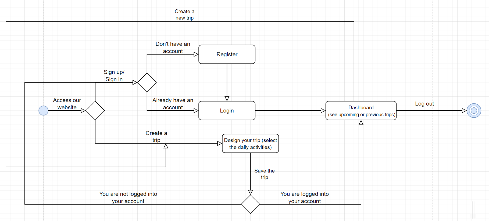

# Trip Designer

## Prerequisites

* [Docker](https://docs.docker.com/get-docker/)
* [Docker Compose](https://docs.docker.com/compose/install/)

---

## Getting started

### Setting up ENV variables

```bash
cd server

cp .env.example .env
```

### Installing the dependencies

```bash
cd client && npm i

cd ..

cd server && npm i
```

### Starting the containers

```bash
docker-compose -f docker-compose.yml --env-file ./server/.env up
```

### Starting the client app

```bash
cd client && npm run start
```

---

## The software development of this project included:

### User stories & backlog creation

&emsp; In order to organize ideas and tasks we used a [Trello board](https://trello.com/b/psYmJyji/tripdesigner). There, we wrote user stories or tasks in cards and moved those cards in different lists, as we resolved them. Lists such as "Backlog", "Ready", "Ongoing", "Code Review", "Ready to be merged", "Done" helped us keep track of changes/bugs/reviews and most important, the stage of the development of our project.

  <p align="center">
  <b> How our Trello board looks during the development:</b>
  </p>
  
 <div style="text-align: center;">
    
  </div>

---
### Design/ architecture/ UML
&emsp; The design of our app can be seen in the following diagrams that suggest the flow of the app and the way the database was organized in tables:

  <p align="center">
  <b>State Diagram</b>
  </p>
  <div style="text-align: center;">
    
  </div>
  
  <p align="center">
  <b>ERD</b>
  </p>
  <div style="text-align: center;">
    
  </div>
  
  <p align="center">
  <b>Conceptual Diagram</b>
  </p>
  <div style="text-align: center;">
    
  </div>

---
### Source control
&emsp; We made use of the Github platform in order to work on this project easily, by creating branches for a specific task, merging them to master when reviews where positive and commiting work anytime something was done. Moreover, Git/Github helped us work separately on different features at the same time.

---
### Unit tests
&emsp; We used Jest, a simple framework that helped us test the functionalities of our app. We came to the conclusion that login & register were of high importance in the app, so unit tests were made for these 2 components in order to make sure everything works as planned.

---
### Bug reporting
&emsp; We used [issues](https://github.com/Andrei0872/trip-designer/issues) on Github to track bugs and problems that occured during the software development.

---
### Build tool
&emsp; TODO 

---
### Refactoring and code standards
&emsp; When a feature was considered finished, a [pull request](https://github.com/Andrei0872/trip-designer/pulls) was created so that other team members could give feedback and review the work. We then made changes to the code according to the review content. In that way, we made sure the code was clean and functional before merging to master and that everyone's opinion was taken into consideration. In parallel, we discussed different ideas and issues on the Trello board as well.

---
### Design patterns
&emsp; TODO


## Visualizing the database with `pgadmin`

* type in `localhost` in the URL bar
* type in the **email** and **password**; they must correspond with the values from the `docker-compose.yml` file
* add a new connection
* for the **hostname**, use the **name of the container**; that can found with `docker ps`

  <div style="text-align: center;">
    
  </div>

* for the **username** and the **password**, use the values from the `.env` file

This is `pgadmin` in action:

<div style="text-align: center;">
  
</div>
